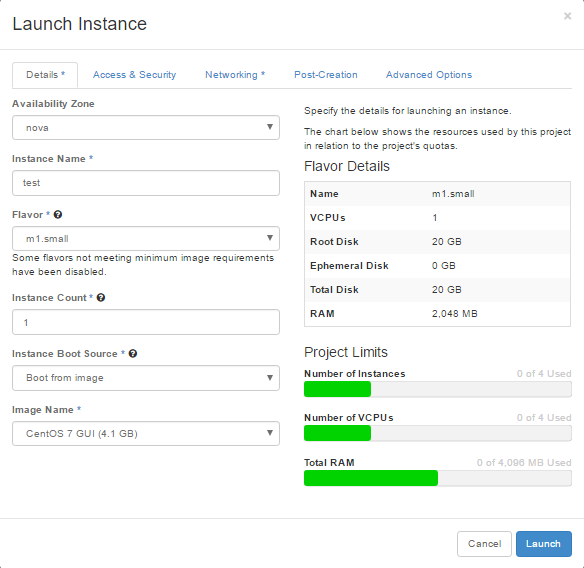
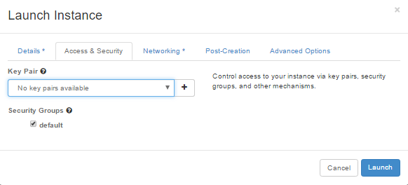
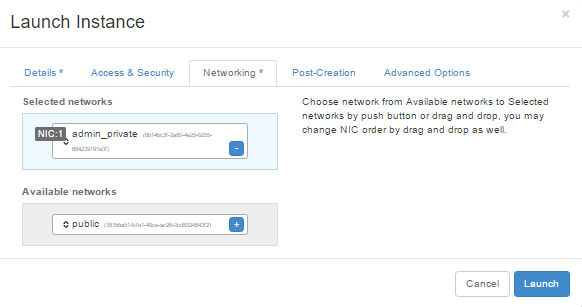
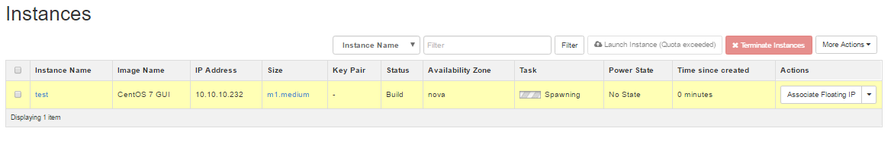

### Setting Up Your Project
Now that we are a little more familiar with our dashboard, let's take the necessary steps to get started and launch an instance. But first, you may want to change your password from the default password provided to us by the administrator.

#### Change Your Password
Log in using the default credentials. Once logged in, on the top right you will see a dropdown menu that is your user name. Click it.  
- Settings  
- Change Password

That's it! Log out and back in again to test your password and we can proceed.  

#### Configuring Access and Security
Without configuring a **security group**, our instance will never be accessible. A security group are the firewall rules. If a security group is not applied to an instance it will block all traffic by default. If a security group is not configured properly, our instance will be inaccessible.

### Launching an Instance
Since we have already explored the dashboard and reset our password, we're ready to launch an instance. This is all performed from the **Compute** tab in the left navbar.  
- Click **Compute**  
- Click **Instances**  
- Click **Launch Instance**  
- Now we are presented with a menu with 5 tabs. Let's start with **Details**.

#### Details
- **Availbility Zone:** nova
-  **Instance Name:** My first instance!** (whatever you want)
-  **Flavor:** Choose an appropriate size for your instance. Remember that some images require a certain amount of resources so we must make sure we are giving ourselves enough resources or launching the instance may fail. If you need a refresher on what size the Flavors are, you can check [here](http://help.snapstack.cloud/user_guide/flavors.md) for a full list - or just tilt your eyes slightly to the right and examine the specifications directly beneath the giant letters that say "Flavor Details".
- **Instance Count:** Choose how many instances you would like to launch.
- **Instance Boot Source:** Most likely you want to boot from an image, however there are options to boot from a volume or snapshot. More about this later.
- **Image Name:** These are the different images that are available to deploy. Select the image you'd like to use.  

#### Access and Security
- **Key Pair** - If you have not created a key pair, you can keep the default of "No key pairs available", otherwise go ahead and select the key pair you'd like to use.
- **Security Groups** - Select the security group that you configured previously. These are our firewall rules. If a security group is not selected, the instance will never be accessible as it will block all traffic by default.

#### Networking
This is a critical step and very easy to screw up. We always, 100% of the time want to choose a **private** network. By default you will have access to the **admin_private** network. This is a /23 subnet this is shared among all projects in order to allow instances from different projects to communicate. In the future we will be able to create our own private networks to keep our instances segregated for testing.
- **Available networks:** Select a private network.

Ignore the last two tabs (**Post Creation** and **Advanced Options**) and click **Launch**.

#### I Launched An Instance!
Launching an instance typically takes less than a few minutes before it is accessible, but this depends heavily on two factors: if this image has ever been launched on the compute node we landed on and the size of the image. Obviously an image that is 2GB is size will launch much faster than a 15GB image.

Wait - what do you mean, "if this image has ever been launched on the compute node we landed on"?
> First of all, we have a lot of compute nodes. Our controller node determines the best location for our instance by comparing the available resources of all of the compute nodes. When an image is deployed on a compute node for the first time, the entire image is copied to the compute node and stored for future use. So if a particular image has never been launched on a compute node before, the first time it is launched on that compute node it will take an extra long time as it needs to first copy the entire image file over. Once that image file is cached on the compute node, it will be stored permanently and will launch in a fraction of the time in the future. We do our best to "burn" in the images to all of the compute nodes before anyone uses them, but occasionally it's possible we missed one as images are being added frequently and targeting an instance on a specific compute node is not currently possible.
